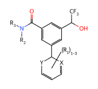
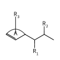

# MolParser

MolParser is a toolkit for **OCSR** (Optical Chemical Structure Recognition) workflows based on **E-SMILES** (Extended SMILES), a molecular string representation designed to support Markush structures and other extended chemical notations. It provides model-based parsing of molecular images and PDFs into E-SMILES / SMILES, together with utilities for E-SMILES normalization, abbreviation substitution, CXSMILES conversion, and structure rendering. The E-SMILES notation follows the formulation introduced in the [MolParser paper](https://arxiv.org/abs/2411.11098).


| Component                           | Role                                                                                                          |
| ----------------------------------- | ------------------------------------------------------------------------------------------------------------- |
| `molparser/models/`                 | OCSR pipeline for image / PDF molecule extraction and recognition                                             |
| `molparser/utils/`                  | E-SMILES utilities for normalization, abbreviation substitution, CXSMILES conversion, and structure rendering |
| `skills/molparser-extended-smiles/` | E-SMILES skills with concise rules and examples for LLM / OCSR agents                                         |
| `skills/molparser-visual-ocsr/`     | OCSR skills for image / PDF molecule extraction workflows                                                     |


## Installation

```bash
git clone https://github.com/dptech-corp/MolParser.git
cd MolParser
pip install -e .
```

If the package index is unavailable but the runtime dependencies are already installed, reuse the local build tools:

```bash
python -m pip install --no-build-isolation -e .
```

For image/PDF OCSR inference, install optional dependencies:

```bash
pip install -r requirements_model.txt
```

Install these model dependencies only when you need PDF rendering, MolDet YOLO detection, Hugging Face / ModelScope model downloads, or MolParser model inference. For E-SMILES post-processing and rendering utilities, `pip install -e .` is enough.

After installation, use the package namespace:

```python
from molparser import MolParser
from molparser import utils as mutils
```


## Quick start


### OCSR Inference

`MolParser` accepts a PIL image, local path, URL, PDF path/URL, or a list of those. Pass a custom YAML or kwargs to override defaults.

Use `rec_only=True` for single-molecule crops; `rec_only=False` to run image detection. PDFs are rendered, then detected with the PDF MolDet model.

MolParser quick start in 3 lines:

```python
from molparser import MolParser

parser = MolParser()
# default config : molparser/models/config.yaml
# default device : "auto"  (or "cpu" / "cuda")
# default MolDet model : UniParser/MolDetv2   (auto-download)
# default OCSR model : UniParser/MolParser-Mobile  (auto-download)

# Single image path.
image_results = parser.parse("mol.png", rec_only=True)
```

Batch image and PDF inputs are also supported:

```python
# Mixed image URLs and local PNG paths.
batch_results = parser.parse(
    [
        "https://example.org/molecule_001.png",
        "./path/to/mol_002.png",
        "./path/to/mol_003.jpeg",
    ],
    rec_only=False,
)

# Single PDF path.
pdf_results = parser.parse("paper.pdf")

for item in image_results + batch_results + pdf_results:
    print(item.input_index, item.page_index, item.bbox, item.esmi)
```

All parsing APIs return `list[MolParserResult]`. Use `result.to_dict()` if you need a plain dictionary:

```python
{
    "source": "mol.png",
    "input_index": 0,
    "page_index": None,
    "bbox": None,
    "confidence": None,
    "raw_caption": "...",
    "caption": "...",
    "smi": "...",
    "esmi": "...",
    "cxsmiles": "...",
    "markush": False,
    "sru": False,
    "groups": "",
}
```

- `source`: the original path, URL, or `PIL.Image`.
- `input_index`: the index in the original input list. For a single input, this is `0`.
- `page_index`: the zero-based PDF page index; `None` for image inputs.
- `bbox`: the detected molecule box `(x1, y1, x2, y2)` in the source image or rendered PDF page; `None` for `rec_only=True`.
- `confidence`: the MolDet confidence score for detected crops; `None` for `rec_only=True`.
- `raw_caption`: the raw MolParser model output.
- `caption`, `smi`, `esmi`, `cxsmiles`, `markush`, `sru`, `groups`: normalized outputs from `postprocess_caption`.

Behavior by input mode:

- Single image with `rec_only=True`: returns one result for the whole image, with `bbox=None`, `confidence=None`, and `page_index=None`.
- Single image with `rec_only=False`: runs MolDet first and returns one result for each detected molecule. If no molecules are detected, the result is an empty list.
- Single PDF: renders each page, runs PDF MolDet, and returns one result for each detected molecule. `page_index`, `bbox`, and `confidence` are populated.
- List input: returns a flat list across all inputs. Use `input_index` to map each result back to the original list item.


## E-SMILES overview

E-SMILES combines a base SMILES with an optional extension:

```text
SMILES<sep>EXTENSION
```

Common extension records:

- `<a>0:R[1]</a>` — atom-indexed substituent or Markush placeholder
- `<a>12:<id>[DNA]</a>` — atom-indexed special Markush label with a custom note
- `<r>0:R[1]</r>` — ring-indexed substituent (regio-uncertain attachment)
- `<c>9:B</c>` — abstract-ring or superatom placeholder
- `<d>0:<dum></d>` — explicit dummy attachment point (E-SMILES 2.0 form; legacy `<a>0:<dum></a>` is still accepted)
- `<s>...</s>` — nested substructure record for ring-external repeat fragments
- `<g>[3:2]:[5:6]:|Sg:n|</g>` — local s-group repeat record with two inner/outer boundary ports
- `<v>0:A:[0:2]</v>` — virtualArc record; the name may be empty and `<r><v>0:R[3]</r>` annotates a substituent on that virtualArc
- `|Sg:n|` — structural repeating unit (SRU) marker
- `?n` — local substructure multiplicity suffixes
- `<a>2:<id>[blue]</a>` — MolParser endpoint-ball extension; other `<id>[...]` values remain text labels

Full specification: [skills/molparser-extended-smiles/extended-smiles-spec.md](skills/molparser-extended-smiles/extended-smiles-spec.md)

### Post-process E-SMILES

Convert E-SMILES to SMILES with abbreviation substitution, and convert E-SMILES to CXSMILES on a best-effort basis.

```python
from molparser import utils as mutils

raw = "*c1ccccc1<sep><a>0:CF3</a>"
result = mutils.postprocess_caption(raw)

# caption: original input string
# smi: normalized RDKit SMILES after substituting known abbreviations
# esmi: normalized E-SMILES after substitution and index repair
# cxsmiles: CXSMILES generated from the normalized E-SMILES
# markush: True if unresolved Markush labels remain
# sru: True if a structural repeating unit marker was detected
# groups: unresolved E-SMILES extension records kept after normalization
for key in ("caption", "smi", "esmi", "cxsmiles", "markush", "sru", "groups"):
    print(f"{key}: {result[key]}")
```

Expected output:

```text
caption: *c1ccccc1<sep><a>0:CF3</a>
smi: FC(F)(F)c1ccccc1
esmi: FC(F)(F)c1ccccc1<sep>
cxsmiles: FC(F)(F)c1ccccc1
markush: False
sru: False
groups:
```


### Substitute Markush Definitions

Substitute Markush labels with a definition dictionary. Definition keys can use either `R1` or `R[1]`; values can be known abbreviations or SMILES fragments. When a fragment contains `*`, that atom is treated as the attachment point.

```python
from molparser import utils as mutils

result = mutils.substitute_markush(
    "*c1ccccc1<sep><a>0:R[1]</a>",
    {"R1": "Me", "R2": "*CCO"},
)
print(result)
# Cc1ccccc1
```

Ring-indexed Markush records expand regio-uncertain attachments into a SMILES list. Multiplicity suffixes such as `?3`, `?1-3`, and `?n` encode local substructure replication over possible ring sites; `?n` reads the replication count from the definition dictionary.

Single-level `<s>...</s>` substructure records have their internal labels substituted and are returned as preserved E-SMILES annotations; they are not attached back into the main molecule and do not change the existing `?` copy behavior. Nesting another `<s>` inside an `<s>` is intentionally rejected. Symbolic SRU counts in `<s>`, `<g>`, or a top-level `|Sg:...|` can be resolved from the same dictionary when the value is one positive integer. For `<g>`, only the count annotation changes—the molecular graph is not expanded.

```python
result = mutils.substitute_markush(
    "c1ccccc1<sep><r>0:R[1]?1-3</r>",
    {"R1": "Me"},
)
print(result)

# ['Cc1cc(C)cc(C)c1', 'Cc1ccc(C)c(C)c1', 'Cc1ccc(C)cc1', 'Cc1cccc(C)c1', 'Cc1cccc(C)c1C', 'Cc1ccccc1', 'Cc1ccccc1C']
```

```python
local_repeat = mutils.Translator.substitute_markush(
    "C<sep><s>*C<sep><a>0:R[1]</a>|Sg:n|</s>",
    {"R1": "Me", "n": 3},
)
# C<sep><s>CC<sep>|Sg:3|</s>
```


### Render E-SMILES

Render E-SMILES as SVG or PNG. Existing SMILES/E-SMILES 1.0 captions retain the original drawing defaults; SRU brackets, local `<g>` brackets, skeletal single-CH2 repeats, empty-name/multiple virtual arcs, and approved endpoint balls are enabled only when their syntax is present.

```python
from pathlib import Path
from molparser import utils as mutils

svg_text = mutils.draw("*C(O)c1cc(C(=O)N(*)*)cc(-c2*ccc*2)c1<sep><a>0:CF3</a><a>9:R[3]</a><a>10:R[2]</a><a>14:X</a><a>18:Y</a><r>1:R[1]?1-3</r>", output_format="svg")

svg_path = Path("molecule.svg")
svg_path.write_text(svg_text, encoding="utf-8")

png_bytes = mutils.draw("CCO", output_format="png")
Path("ethanol.png").write_bytes(png_bytes)
```

`molecule.svg` is a local render artifact.

To obtain a PNG from that SVG (requires `cairosvg` from `requirements.txt`):

```python
import cairosvg

png_path = Path("molecule.png")
cairosvg.svg2png(url=str(svg_path), write_to=str(png_path))
```

Rendered example:



**Updates**

`draw` also supports virtual ring-closure connections encoded with `<v>...</v>` and `<r><v>...</r>`. New data should encode every closure as `[small_atom_id:large_atom_id]`; reversed legacy pairs remain readable.

E-SMILES: `C=CCC(C(C)*)*<sep><a>6:R[2]</a><a>7:R[1]</a><v>0:A:[0:2]</v><r><v>0:R[3]</r>`



For batches, `draw_many` validates one shared configuration and preserves input order:

```python
svgs = mutils.draw_many(
    ["CCO", "CCN", "CC*CC<sep><a>2:CH2?3</a>"],
    output_format="svg",
)
```

## LLM / OCSR workflow


### Skill context

For image/PDF molecule extraction with MolDet and MolParser recognition, load:

- `skills/molparser-visual-ocsr/SKILL.md`

For E-SMILES generation, validation, normalization, Markush substitution, and rendering, load:

- `skills/molparser-extended-smiles/SKILL.md`
- `skills/molparser-extended-smiles/extended-smiles-spec.md`
- `skills/molparser-extended-smiles/figure-index.md`


### Expected model output

```text
1. Base SMILES
2. E-SMILES in SMILES<sep>EXTENSION format
3. Markush status
4. Unsupported or ambiguous chemistry
```


### Validate and normalize

```bash
python skills/molparser-extended-smiles/validate_esmiles.py "<your_esmiles>"
```

Then normalize and render with `mutils.postprocess_caption` and `mutils.draw`.

## Related resources

Huggingface Homepage: [UniParser/molparser](https://huggingface.co/collections/UniParser/molparser)

- [Uni-Parser](https://arxiv.org/abs/2512.15098) — agent-oriented scientific document parsing with the latest MolParser. [Demo](https://uniparser.dp.tech/)
- [MolParser](https://arxiv.org/abs/2411.11098) — end-to-end molecular recognition. [Demo](https://ocsr.dp.tech/)
- [MolDetv2 weights](https://huggingface.co/UniParser/MolDetv2) — lightweight molecule detector. [Demo](https://huggingface.co/spaces/AI4Industry/MolDet)


## Citation

```bibtex
@inproceedings{fang2025molparser,
  title={Molparser: End-to-end visual recognition of molecule structures in the wild},
  author={Fang, Xi and Wang, Jiankun and Cai, Xiaochen and Chen, Shangqian and Yang, Shuwen and Tao, Haoyi and Wang, Nan and Yao, Lin and Zhang, Linfeng and Ke, Guolin},
  booktitle={Proceedings of the IEEE/CVF International Conference on Computer Vision},
  pages={24528--24538},
  year={2025}
}
```

```bibtex
@article{fang2025uniparser,
  title={Uni-Parser Technical Report},
  author={Fang, Xi and Tao, Haoyi and Yang, Shuwen and Zhong, Suyang and Lu, Haocheng and Lyu, Han and Huang, Chaozheng and Li, Xinyu and Zhang, Linfeng and Ke, Guolin},
  journal={arXiv preprint arXiv:2512.15098},
  year={2025}
}
```


## License

The project code is licensed under the Apache License 2.0. See [LICENSE](LICENSE) for details. Apache 2.0 permits **commercial use**, modification, and distribution, **provided that the license and copyright notices are retained**.

**Model weights, datasets, and third-party dependencies used with this project are subject to their respective licenses. Please review and comply with those licenses when using them.**
