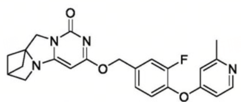
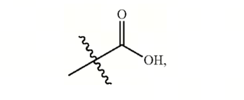
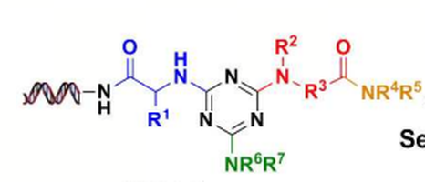
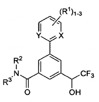
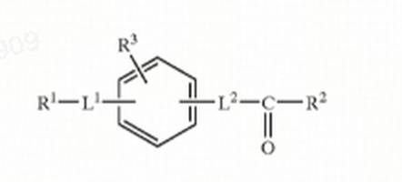
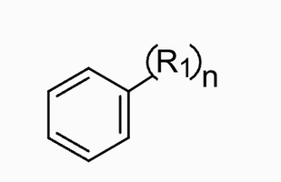
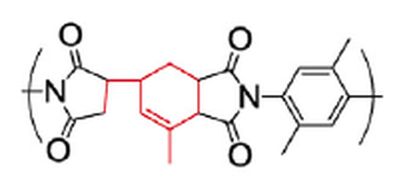

# E-SMILES Figure Guide

This guide turns the supported figures into writing rules for MolParser E-SMILES. Use it after `extended-smiles-spec.md` when examples are needed.

## Model Writing Rules

1. Always output `SMILES<sep>EXTENSION`. If there is no extension, output `SMILES<sep>`.
2. Use zero-based indexes from the chosen base SMILES.
3. Use `<a>` for atom-indexed substituents, abbreviations, Markush groups, and dummy attachment points.
4. Use `<r>` only when a substituent belongs to a ring but the exact attachment atom is not specified.
5. Use `<c>` for abstract-ring or superatom labels carried by a dummy atom.
6. Use `?n`, `?1-3`, or `?3` for group-level multiplicity.
7. Use `|Sg:n|` only for structural repeating unit (SRU) repetition.
8. Do not invent tokens for unsupported chemistry. Preserve the encodable backbone and report what cannot be encoded.

## Supported Examples

### Example 1: Ordinary Molecule



Use an empty extension for a fully specified ordinary molecule.

```text
Cc1cc(Oc2ccc(COc3cc4n(c(=O)n3)CC35CC(CN43)C5)cc2F)ccn1<sep>
```

### Example 2: Atom-Indexed Markush Substituent


Use `<a>[ATOM_INDEX]:[GROUP_LABEL]</a>` when a substituent is anchored to a known atom.

```text
*c1ccccc1<sep><a>0:R[1]</a>
```

### Example 3: Dummy Attachment Point



Use `<a>[ATOM_INDEX]:<dum></a>` to preserve an explicit attachment point.

```text
*C(O)=O<sep><a>0:<dum></a>
```

### Example 4: Dataset-Specific Markush Label



Keep dataset-specific graphical labels as group payloads when they cannot be reduced to standard substituent abbreviations.

```text
N(C(=O)C(*)NC1N=C(N(*)*)N=C(N(*)*C(=O)N(*)*)N=1)*<sep><a>4:R[1]</a><a>10:R[6]</a><a>11:R[7]</a><a>15:R[2]</a><a>16:R[3]</a><a>20:R[4]</a><a>21:R[5]</a><a>23:<id>[DNA]</a>
```

### Example 5: Regio-Uncertain Ring Substituent



Use `<r>[RING_INDEX]:[GROUP_LABEL]</r>` when a substituent is attached somewhere on a ring and the exact atom is unspecified. Add `?1-3` for a local repeat range.

```text
*C(O)c1cc(C(=O)N(*)*)cc(-c2*ccc*2)c1<sep><a>0:CF3</a><a>9:R[3]</a><a>10:R[2]</a><a>14:X</a><a>18:Y</a><r>1:R[1]?1-3</r>
```

### Example 6: Multiple Ring-Level Substituents


Write one `<r>` record per ring-level substituent. Multiple records may share the same ring index.

```text
C1C=CC=CC=1<sep><r>0:R[1]</r><r>0:R[2]</r>
```

### Example 7: Complex Ring-Level Labels



Keep complex group labels inside the `<r>` payload when the ring attachment position remains unresolved.

```text
c1ccccc1<sep><r>0:L[1]R[1]</r><r>0:L[2]COR[2]</r><r>0:R[3]</r>
```

### Example 8: Group-Level Multiplicity



Use a suffix on the group label for local multiplicity. This is not the same as an SRU repeat.

```text
C1C=CC=C(*)C=1<sep><a>5:R[1]?n</a>
```

### Example 9: Structural Repeating Unit



Use `|Sg:n|` for SRU-level repetition after identifying the repeat unit in the source depiction.

```text
*c1cc(C)c(N2C(=O)C3C(C)=CC(C4CC(=O)N(*)C4=O)CC3C2=O)cc1C<sep>|Sg:n|
```

### Example 10: Abstract-Ring / Superatom Placeholder


Use `<c>[ATOM_INDEX]:[RING_LABEL]</c>` for an abstract ring or superatom carried by a dummy atom. Other atom-indexed substituents can appear in the same extension.

```text
*C(NC(*)(*)C(*)(*)*)C(=O)N(*)*<sep><a>0:R[1]</a><a>4:R[3]</a><a>5:R[2]</a><a>7:R[5]</a><a>8:R[4]</a><c>9:B</c><a>13:R[7]</a><a>14:R[6]</a>
```

## Unsupported Or Ambiguous Source Features

If a source depiction contains coordination semantics, electron-transfer arrows, uncertain bond style, or uncertain chirality, do not force it into a new token. Output the best encodable E-SMILES backbone and list the unsupported feature separately.
