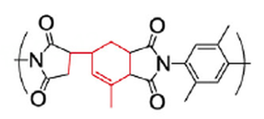

# E-SMILES Figure Guide

This guide turns the supported figures into writing rules for MolParser E-SMILES. Use it after `extended-smiles-spec.md` when examples are needed.

## Model Writing Rules

1. Always output `SMILES<sep>EXTENSION`. If there is no extension, output `SMILES<sep>`.
2. Use zero-based indexes from the chosen base SMILES.
3. Use `<a>` for atom-indexed substituents, abbreviations, and Markush groups.
4. Use `<d>` for explicit dummy attachment points. The legacy `<a>[ATOM_INDEX]:<dum></a>` form is still accepted for backward compatibility.
5. Use `<r>` only when a substituent belongs to a ring but the exact attachment atom is not specified.
6. Use `<c>` for abstract-ring or superatom labels carried by a dummy atom.
7. Use `<v>` for special virtualArc annotations, and `<r><v>...</r>` for substituents attached to that virtualArc.
8. Use `<s>` for a nested substructure record outside the main ring system.
9. Use `<g>` for s-group repeat records with `[INNER_PORT:OUTER_PORT]` pairs and `|Sg:n|`.
10. Use `?n`, `?1-3`, or `?3` for local substructure multiplicity.
11. Use top-level `|Sg:n|` for whole structural repeating unit (SRU) repetition.
12. Do not invent tokens for unsupported chemistry. Preserve the encodable backbone and report what cannot be encoded.

## Supported Examples

### Example 1: Ordinary Molecule


Use an empty extension for a fully specified ordinary molecule.

```text
Cc1cc(Oc2ccc(COc3cc4n(c(=O)n3)CC35CC(CN43)C5)cc2F)ccn1<sep>
```

### Example 2: Atom-Indexed Markush Substituent


Use `<a>[ATOM_INDEX]:[GROUP_LABEL]</a>` when a substituent is anchored to a known atom.

```text
*c1ccccc1<sep><a>0:R[1]</a>
```

### Example 3: Dummy Attachment Point


Use `<d>[ATOM_INDEX]:<dum></d>` to preserve an explicit attachment point.

```text
*C(O)=O<sep><d>0:<dum></d>
```

### Example 4: Dataset-Specific Markush Label


Use `<id>[NOTE]` for special Markush labels that cannot be reduced to standard substituent abbreviations, such as DNA/RNA/protein fragments, colors, or graphical labels.

```text
N(C(=O)C(*)NC1N=C(N(*)*)N=C(N(*)*C(=O)N(*)*)N=1)*<sep><a>4:R[1]</a><a>10:R[6]</a><a>11:R[7]</a><a>15:R[2]</a><a>16:R[3]</a><a>20:R[4]</a><a>21:R[5]</a><a>23:<id>[DNA]</a>
```

### Example 5: Regio-Uncertain Ring Substituent


Use `<r>[RING_INDEX]:[GROUP_LABEL]</r>` when a substituent is attached somewhere on a ring and the exact atom is unspecified. Add `?1-3` for a local substructure multiplicity range.

```text
*C(O)c1cc(C(=O)N(*)*)cc(-c2*ccc*2)c1<sep><a>0:CF3</a><a>9:R[3]</a><a>10:R[2]</a><a>14:X</a><a>18:Y</a><r>1:R[1]?1-3</r>
```

### Example 6: Multiple Ring-Level Substituents


Write one `<r>` record per ring-level substituent. Multiple records may share the same ring index.

```text
C1C=CC=CC=1<sep><r>0:R[1]</r><r>0:R[2]</r>
```

### Example 7: Complex Ring-Level Labels


Keep complex group labels inside the `<r>` payload when the ring attachment position remains unresolved.

```text
c1ccccc1<sep><r>0:L[1]R[1]</r><r>0:L[2]COR[2]</r><r>0:R[3]</r>
```

### Example 8: Local Substructure Multiplicity


Use a suffix on the group label for local substructure multiplicity. This is not the same as an SRU repeat.

```text
C1C=CC=C(*)C=1<sep><a>5:R[1]?n</a>
```

### Example 9: Structural Repeating Unit



Use `|Sg:n|` for SRU-level repetition after identifying the repeat unit in the source depiction.

```text
*c1cc(C)c(N2C(=O)C3C(C)=CC(C4CC(=O)N(*)C4=O)CC3C2=O)cc1C<sep>|Sg:n|
```

### Example 10: Abstract-Ring / Superatom Placeholder


Use `<c>[ATOM_INDEX]:[RING_LABEL]</c>` for an abstract ring or superatom carried by a dummy atom. Other atom-indexed substituents can appear in the same extension.

```text
*C(NC(*)(*)C(*)(*)*)C(=O)N(*)*<sep><a>0:R[1]</a><a>4:R[3]</a><a>5:R[2]</a><a>7:R[5]</a><a>8:R[4]</a><c>9:B</c><a>13:R[7]</a><a>14:R[6]</a>
```

### Example 11: Nested Repeat Substructure

Use `<s>...</s>` when a repeat fragment is best represented as a nested substructure E-SMILES. For simpler cases, a local shorthand such as `<a>11:L[3]R[3]?n</a>` is also acceptable.

```text
N1=C(N)C2=C(C(=C(N2)*)***)N=C1**<sep><a>8:R[2]</a><a>9:L[2]</a><a>10:B</a><s>**<sep><a>0:L[3]</a><a>1:R[3]</a>|Sg:n|</s><a>14:L[1]</a><a>15:R[1]</a>
```

### Example 12: Whole Polymer Repeat

For whole-polymer repetition, keep terminal placeholders as `*` atoms in the base SMILES, mark them with `<d>`, and add a top-level `|Sg:n|`.

```text
c1(*)c(C)cc(N2C(=O)C3C(C(C)=CC(C4C(=O)N(*)C(=O)C4)C3)C2=O)c(C)c1<sep><d>1:<dum></d><d>19:<dum></d>|Sg:n|
```

### Example 13: VirtualArc

Use `<v>[VIRTUALARC_INDEX]:[VIRTUALARC_NAME]:[FROM_ATOM:TO_ATOM]</v>` to preserve a special abstract ring. The connection is not directional, so readers may accept either endpoint order; new datasets should emit `FROM_ATOM < TO_ATOM`. Use `<r><v>[VIRTUALARC_INDEX]:[GROUP_LABEL]</r>` for a group attached to the virtualArc.

```text
C=CCC(C(C)*)*<sep><a>6:R[2]</a><a>7:R[1]</a><v>0:A:[0:2]</v><r><v>0:R[3]</r>
```

### Example 14: S-Group Repeat

Use `<g>[INNER_PORT:OUTER_PORT]:...:|Sg:n|</g>` for a repeated s-group with one or more port pairs.

```text
C=CCC(C(C)*)*<sep><a>6:R[2]</a><a>7:R[1]</a><g>[3:2]:[4:5]:|Sg:20|</g>
```

## Unsupported Or Ambiguous Source Features

If a source depiction contains coordination semantics, electron-transfer arrows, uncertain bond style, or uncertain chirality, do not force it into a new token. Output the best encodable E-SMILES backbone and list the unsupported feature separately.

## Representative Rendering Examples

For four compact examples covering fixed-color endpoint balls, a Whole SRU,
a local `<g>` repeat, and a large stereochemical atom-Markush structure, read
[`references/synthetic-examples.md`](references/synthetic-examples.md).
