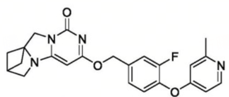
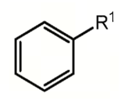
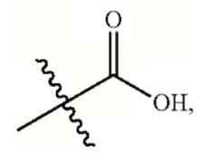
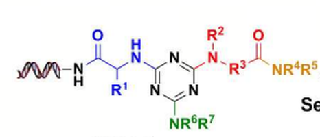
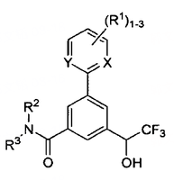
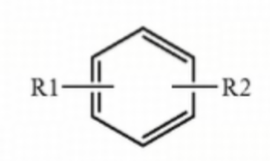
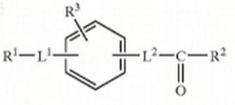
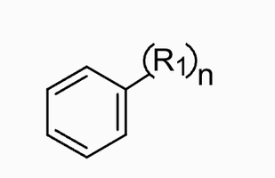
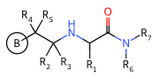

# E-SMILES Figure Guide

Use this guide after `extended-smiles-spec.md` when a visual example is needed. Every example follows the same order: encoding guidance, raw E-SMILES, then the corresponding rendering.

## Model Writing Rules

1. Output `SMILES<sep>EXTENSION`. If there is no extension, output `SMILES<sep>`.
2. Use zero-based indexes from the selected base SMILES.
3. Use `<a>` for atom-indexed substituents, abbreviations, and Markush groups.
   Encode a special label as `<id>[NOTE]`: draw `NOTE` as text unless the
   indexed atom is `*` and `NOTE` is an approved endpoint-ball token.
4. Use `<d>` for explicit dummy attachment points. Continue accepting legacy `<a>[ATOM_INDEX]:<dum></a>` input.
5. Use `<r>` when a substituent belongs to a ring but its exact attachment atom is unspecified.
6. Use `<c>` for an abstract-ring or superatom label carried by a dummy atom.
7. Use `<v>` for a virtualArc and `<r><v>...</r>` for a group attached to that virtualArc.
8. Use one level of `<s>` for a nested substructure record outside the main ring system.
9. Use `<g>` for an s-group repeat with `[INNER_PORT:OUTER_PORT]` pairs and `|Sg:COUNT|`.
10. Use `?n`, `?1-3`, or `?3` for local substructure multiplicity.
11. Use top-level `|Sg:COUNT|` for a whole structural repeating unit.
12. Use `<x>[ATOM_1:ATOM_2]:Ra</x>` or `:Sa</x>` for a biphenyl stereogenic axis; use the directly bonded aromatic axis atoms in ascending index order.
13. Do not invent tokens for unsupported chemistry. Preserve the encodable backbone and report the unsupported feature separately.

## Encoding and Rendering Examples

### 1. Ordinary molecule

Use an empty extension for a fully specified molecule with no E-SMILES annotation.

```text
Cc1cc(Oc2ccc(COc3cc4n(c(=O)n3)CC35CC(CN43)C5)cc2F)ccn1<sep>
```



### 2. Atom-indexed Markush substituent

Use `<a>[ATOM_INDEX]:[GROUP_LABEL]</a>` when the substituent is anchored to a known atom.

```text
*c1ccccc1<sep><a>0:R[1]</a>
```



### 3. Dummy attachment point

Use `<d>[ATOM_INDEX]:<dum></d>` to retain an explicit connection point.

```text
*C(O)=O<sep><d>0:<dum></d>  # in E-SMILES 2.0
# *C(O)=O<sep><a>0:<dum></a>  # in E-SMILES 1.0
```



### 4. Special Markush label

Use `<id>[NOTE]` for graphical or dataset-specific labels that lack standard substituent abbreviations. In this example, `DNA` is preserved and rendered directly as group text rather than being treated as a definition key.

```text
N(C(=O)C(*)NC1N=C(N(*)*)N=C(N(*)*C(=O)N(*)*)N=1)*<sep><a>4:R[1]</a><a>10:R[6]</a><a>11:R[7]</a><a>15:R[2]</a><a>16:R[3]</a><a>20:R[4]</a><a>21:R[5]</a><a>23:<id>[DNA]</a>
```



This atom-indexed syntax allows assigning approved color names to render `*` atoms as visual-only colored circular groups—a common chemistry journal convention—with unrecognized values defaulting to standard text labels.

```text
*CC(=O)Nc1c(C#N)c(*)nn1C*<sep><a>0:<id>[blue]</a><a>10:<id>[green]</a><a>14:<id>[green]</a>
```


### 5. Regio-uncertain ring substituent

Use `<r>[RING_INDEX]:[GROUP_LABEL]</r>` when the exact attachment atom on a ring is unknown. Append `?1-3` when one to three copies are possible.

```text
*C(O)c1cc(C(=O)N(*)*)cc(-c2*ccc*2)c1<sep><a>0:CF3</a><a>9:R[3]</a><a>10:R[2]</a><a>14:X</a><a>18:Y</a><r>1:R[1]?1-3</r>
```



### 6. Multiple ring-level substituents

Write one `<r>` record per unresolved ring-level substituent. Multiple records may share the same ring index.

```text
C1C=CC=CC=1<sep><r>0:R[1]</r><r>0:R[2]</r>
```



### 7. Complex ring-level labels

Keep a composite label inside the `<r>` payload when its ring attachment position remains unresolved.

```text
c1ccccc1<sep><r>0:L[1]R[1]</r><r>0:L[2]COR[2]</r><r>0:R[3]</r>
```



### 8. Local substructure multiplicity

Append a multiplicity suffix to the group label for a local copy count. This differs from an SRU-level `|Sg:COUNT|` marker.

```text
C1C=CC=C(*)C=1<sep><a>5:R[1]?n</a>
```



### 9. Abstract-ring or superatom placeholder

Use `<c>[ATOM_INDEX]:[RING_LABEL]</c>` for an abstract ring or superatom carried by a dummy atom. Other atom-indexed records may coexist in the extension.

```text
*C(NC(*)(*)C(*)(*)*)C(=O)N(*)*<sep><a>0:R[1]</a><a>4:R[3]</a><a>5:R[2]</a><a>7:R[5]</a><a>8:R[4]</a><c>9:B</c><a>13:R[7]</a><a>14:R[6]</a>
```



### 10. Whole SRU with explicit terminal dummies

Use top-level `|Sg:n|` for a whole repeat. 

```text
*OCCOC(=O)c1ccc(C(*)=O)cc1<sep><d>0:<dum></d><d>12:<dum></d>|Sg:n|  # in E-SMILES 2.0
# *OCCOC(=O)c1ccc(C(*)=O)cc1<sep>|Sg:n|  # in E-SMILES 1.0
```


### 11. Local s-group repeat

Use `<g>[INNER_PORT:OUTER_PORT]:...:|Sg:COUNT|</g>` to identify the repeated local subgraph and its boundary bonds.

```text
CC(=O)NCOCCC1CC1<sep><g>[5:4]:[6:7]:|Sg:n|</g>
```


### 12. VirtualArc with an attached group

Use `<v>[ARC_ID]:[NAME]:[SMALL_ATOM_ID:LARGE_ATOM_ID]</v>` for a virtual ring closure. Add `<r><v>[ARC_ID]:[GROUP_LABEL]</r>` when a group is attached to the arc. Keep new endpoint pairs in ascending order.

```text
C=CCC(C(C)*)*<sep><a>6:R[2]</a><a>7:R[1]</a><v>0:A:[0:2]</v><r><v>0:R[3]</r>
```


## Unsupported or Ambiguous Source Features

If a depiction contains unsupported coordination semantics, electron-transfer arrows, uncertain bond style, or uncertain chirality, do not force it into a new token. Output the best encodable E-SMILES backbone and report the unsupported feature separately.
