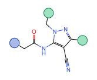
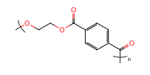
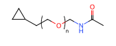
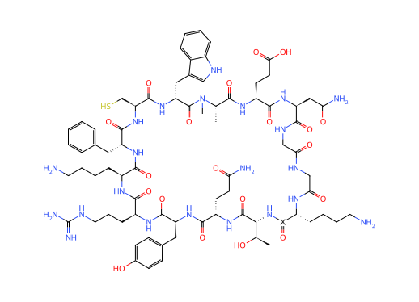

# Representative Drawing Examples

Draw these raw E-SMILES strings directly with `molparser.utils.draw`. Do not
substitute annotations first when the brackets or endpoint balls must remain
visible. All four records pass the strict repository validator.

## Fixed-color endpoint balls

```text
*CC(=O)Nc1c(C#N)c(*)nn1C*<sep><a>0:<id>[blue]</a><a>10:<id>[green]</a><a>14:<id>[green]</a>
```

`blue` and `green` are MolParser endpoint-ball extensions, not general chemical
identity tokens.



## Whole SRU

```text
*OCCOC(=O)c1ccc(C(*)=O)cc1<sep><d>0:<dum></d><d>12:<dum></d>|Sg:n|
```

The `<d>` records are the E-SMILES 2.0 dummy form. The SRU brackets and `n`
remain visible only when drawing the raw E-SMILES.



## Local s-group repeat

```text
CC(=O)NCOCCC1CC1<sep><g>[5:4]:[6:7]:|Sg:n|</g>
```

The two pairs are `[INNER_PORT:OUTER_PORT]`. Resolving the count changes the
annotation only; it does not physically expand the molecular graph.



## Macrocyclic peptide Markush label

```text
C[C@@H](O)[C@H]1N*(=O)[C@@H](CCCCN)NC(=O)CNC(=O)CNC(=O)[C@H](CC(N)=O)NC(=O)[C@H](CCC(=O)O)NC(=O)[C@H](C)N(C)C(=O)[C@@H](Cc2c[nH]c3ccccc23)NC(=O)[C@H](CS)NC(=O)[C@@H](Cc2ccccc2)NC(=O)[C@H](CCCCN)NC(=O)[C@H](CCCNC(=N)N)NC(=O)[C@H](Cc2ccc(O)cc2)NC(=O)[C@H](CCC(N)=O)NC1=O<sep><a>5:X</a>
```

This is an E-SMILES 1.0-compatible atom-indexed Markush example and a regression
case for large stereochemical structures. `X` remains unresolved in the drawing.


